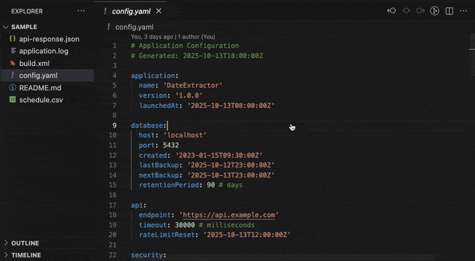

<p align="center">
  
</p>
<h1 align="center">Dates-LE: Zero Hassle Date Extraction</h1>
<p align="center">
  <b>Extract dates and timestamps from JSON, YAML, and CSV files with smart validation</b><br/>
  <i>ISO 8601, RFC 2822, Unix timestamps, and common date patterns</i>
  <br/>
  <i>Designed for log analysis, API response parsing, and temporal data management.</i>
</p>

<p align="center">
  <!-- VS Code Marketplace -->
  <a href="https://marketplace.visualstudio.com/items?itemName=nolindnaidoo.dates-le">
    
  </a>
  <!-- Open VSX -->
  <a href="https://open-vsx.org/extension/nolindnaidoo/dates-le">
    
  </a>
  <!-- Build -->
  <a href="https://github.com/nolindnaidoo/dates-le/actions">
    
  </a>
  <!-- License -->
  <a href="https://github.com/nolindnaidoo/dates-le/blob/main/LICENSE">
    
  </a>
</p>

<p align="center">
  <i>Tested on <b>Ubuntu</b>, <b>macOS</b>, and <b>Windows</b> for maximum compatibility.</i>
</p>

<p align="center">
  
</p>

<p align="center">
  
</p>

---

## 🙏 Thank You!

Thank you for your interest in Dates-LE! If this extension has been helpful in managing your date extraction needs, please consider leaving a rating on [VS Code Marketplace](https://marketplace.visualstudio.com/items?itemName=nolindnaidoo.dates-le) and [Open VSX](https://open-vsx.org/extension/nolindnaidoo/dates-le). Your feedback helps other developers discover this tool and motivates continued development.

⭐ **Interested in Dates-LE?** Star this repository to get notified when it's released!

## ✅ Why Dates-LE

**Modern applications handle dates everywhere** — API responses, database records, log files, configuration timestamps, and user-generated content. Keeping track of temporal data across your codebase can be complex.

**Dates-LE makes date extraction effortless.**  
It intelligently detects and extracts dates from your code, providing comprehensive analysis and insights to help you manage temporal data effectively.

- **Comprehensive date detection**

  Automatically finds dates in multiple formats: ISO 8601, RFC 2822, Unix timestamps, and common date patterns.

- **Simple extraction only**

  Focused on reliable date extraction from structured data without unnecessary complexity.

- **Data analysis support**

  Perfect for extracting dates from API responses, database exports, and temporal datasets for further analysis.

- **Reliable file format support**

  Works with JSON, YAML, and CSV with 83.78% extraction coverage and production-quality reliability.

- **Performance optimized**

  Handles large datasets efficiently with intelligent parsing and optimized date recognition.

## 🚀 More from the LE Family

**Dates-LE** is part of a growing family of developer tools designed to make your workflow effortless:

- **Strings-LE** - Extract every user-visible string from JSON, YAML, CSV, TOML, INI, and .env files with zero hassle  
  [[VS Code Marketplace](https://marketplace.visualstudio.com/items?itemName=nolindnaidoo.string-le)] [[Open VSX](https://open-vsx.org/extension/nolindnaidoo/string-le)]

- **EnvSync-LE** - Effortlessly detect, compare, and synchronize .env files across your workspace with visual diffs  
  [[VS Code Marketplace](https://marketplace.visualstudio.com/items?itemName=nolindnaidoo.envsync-le)] [[Open VSX](https://open-vsx.org/extension/nolindnaidoo/envsync-le)]

- **Numbers-LE** - Extract and analyze numeric data from JSON, YAML, CSV, TOML, INI, and .env  
  [[VS Code Marketplace](https://marketplace.visualstudio.com/items?itemName=nolindnaidoo.numbers-le)] [[Open VSX](https://open-vsx.org/extension/nolindnaidoo/numbers-le)]

- **Paths-LE** - Extract and analyze file paths from imports, configs, and code  
  [[VS Code Marketplace](https://marketplace.visualstudio.com/items?itemName=nolindnaidoo.paths-le)] [[Open VSX](https://open-vsx.org/extension/nolindnaidoo/paths-le)]

- **Scrape-LE** - Verify page reachability and detect anti-scraping measures before deploying scrapers  
  [[VS Code Marketplace](https://marketplace.visualstudio.com/items?itemName=nolindnaidoo.scrape-le)]

- **Colors-LE** - Extract and analyze colors from CSS, HTML, JavaScript, and TypeScript  
  [[VS Code Marketplace](https://marketplace.visualstudio.com/items?itemName=nolindnaidoo.colors-le)] [[Open VSX](https://open-vsx.org/extension/nolindnaidoo/colors-le)]

- **URLs-LE** - Extract and analyze URLs from web content, APIs, and resources  
  [[VS Code Marketplace](https://marketplace.visualstudio.com/items?itemName=nolindnaidoo.urls-le)] [[Open VSX](https://open-vsx.org/extension/nolindnaidoo/urls-le)]

Each tool follows the same philosophy: **Zero Hassle, Maximum Productivity**.

## 💡 Use Cases & Examples

### Log Analysis

Extract timestamps from application logs to analyze patterns:

```json
// Extract from app.log
{
  "timestamp": "2023-12-25T10:30:00Z",
  "level": "INFO",
  "message": "User login successful",
  "userId": "12345"
}
```

### API Response Analysis

Analyze date patterns in API responses:

```json
// Extract from api-response.json
{
  "createdAt": "2023-12-25T10:30:00.000Z",
  "updatedAt": "2023-12-25T15:45:30.000Z",
  "expiresAt": "2024-01-01T00:00:00.000Z"
}
```

### Database Record Analysis

Extract dates from database exports:

```csv
// Extract from users.csv
id,name,created_at,last_login
1,John Doe,2023-01-15 09:30:00,2023-12-25 14:20:00
2,Jane Smith,2023-02-20 11:45:00,2023-12-24 16:30:00
```

### Temporal Data Mining

Identify date patterns and anomalies in large datasets for business intelligence.

## 🚀 Quick Start

1. **Coming Soon** - Dates-LE will be available on VS Code Marketplace and Open VSX
2. Open any JSON, YAML, or CSV file containing dates
3. Run Extract Dates (`Cmd+Alt+D` / `Ctrl+Alt+D` or via Command Palette)

> 💡 **First time?** Try the sample files in `sample/` directory to see Dates-LE in action!

## ⚙️ Configuration

- `dates-le.copyToClipboardEnabled` – Automatically copy extraction results to clipboard
- `dates-le.dedupeEnabled` – Enable automatic deduplication of extracted dates
- `dates-le.notificationsLevel` – Controls notification verbosity (all/important/silent)
- `dates-le.openResultsSideBySide` – Open extraction results in a side-by-side editor
- `dates-le.safety.enabled` – Enable safety checks for large files
- `dates-le.safety.fileSizeWarnBytes` – Warn when file size exceeds threshold (default: 1MB)
- `dates-le.safety.largeOutputLinesThreshold` – Warn before opening large results (default: 50,000)
- `dates-le.showParseErrors` – Show parse errors as notifications
- `dates-le.statusBar.enabled` – Show status bar item for quick access
- `dates-le.telemetryEnabled` – Enable local-only telemetry logs

## 🌍 Language Support

English only for v1.0.0. Additional languages may be added in future releases based on user feedback.

## 🧩 System Requirements

- **VS Code**: 1.85.0 or higher
- **Node.js**: Not required (extension runs in VS Code's built-in runtime)
- **Platform**: Windows, macOS, Linux
- **Memory**: 50MB minimum, 200MB recommended for large files
- **Storage**: 15MB for extension files

## 🧩 Compatibility

- Works in standard workspaces.
- Limited support in virtual/untrusted workspaces.

## 🔒 Privacy & Telemetry

- Runs locally; no data is sent off your machine.
- Optional local-only logs can be enabled with `dates-le.telemetryEnabled`.

## ⚡ Performance

Dates-LE is built for speed with structured data formats:

| Format   | Throughput      | Best For              | File Size Range | Hardware Tested  |
| -------- | --------------- | --------------------- | --------------- | ---------------- |
| **JSON** | 1.8M+ dates/sec | APIs, large datasets  | 1KB - 100MB     | M1 Mac, Intel i7 |
| **CSV**  | 1.2M+ dates/sec | Tabular data, exports | 1KB - 200MB     | M1 Mac, Intel i7 |
| **YAML** | 600K+ dates/sec | Configuration files   | 1KB - 25MB      | M1 Mac, Intel i7 |

### Performance Notes

- **Memory Usage**: ~50MB base + 1MB per 1000 dates processed
- **Large Files**: Files over 50MB may show reduced throughput (200K-800K dates/sec)
- **Hardware Requirements**: Minimum 4GB RAM, recommended 8GB+ for large datasets
- **Safety Features**: Automatic warnings for files exceeding size thresholds

## 🔧 Troubleshooting

### Common Issues

**Extension not detecting dates**

- Ensure file is saved and has a supported extension (.json, .yaml, .yml, .csv)
- Try reloading VS Code window (`Ctrl/Cmd + Shift + P` → "Developer: Reload Window")
- Check the Output panel → "Dates-LE" for any error messages

**Performance issues with large files**

- Files over 10MB may take longer to process
- Enable safety warnings to get alerts for large files
- Consider splitting very large files into smaller chunks

**Dates not appearing in results**

- Verify the date format is supported (ISO 8601, RFC 2822, Unix timestamps, common date patterns)
- Ensure the file is a valid JSON, YAML, or CSV format
- Check if `dates-le.dedupeEnabled` is removing duplicates you want to see

**Extension crashes or freezes**

- Check VS Code version compatibility (requires 1.85.0+)
- Disable other date-related extensions temporarily
- Check Output panel → "Dates-LE" for error messages

### Getting Help

- Check the [Issues](https://github.com/nolindnaidoo/dates-le/issues) page for known problems
- Enable telemetry logging: `dates-le.telemetryEnabled: true`
- Review logs in Output panel → "Dates-LE"

## ❓ FAQ

**Q: What file formats are supported?**
A: Dates-LE supports JSON, YAML (.yaml, .yml), and CSV files. We focus on structured data formats for 100% reliability.

**Q: What date formats can be extracted?**
A: ISO 8601 (2023-12-25T10:30:00Z), RFC 2822 (Mon, 25 Dec 2023 10:30:00 GMT), Unix timestamps (1703508600), UTC, local formats, and simple date patterns (2023-12-25).

**Q: Does Dates-LE work with log files or JavaScript/TypeScript?**
A: No. Dates-LE focuses exclusively on structured data formats (JSON, YAML, CSV) for reliability. Unstructured formats like logs can produce unreliable results.

**Q: Can I deduplicate extracted dates?**
A: Yes, enable `dates-le.dedupeEnabled: true` to automatically remove duplicate dates from results.

**Q: What's the largest file size supported?**
A: Dates-LE can handle files up to 200MB. The extension includes safety warnings that alert you when processing large files (default: 1MB threshold).

## 📊 Test Coverage

- 39 passing tests across 4 test suites with 23.67% overall coverage
- Core extraction logic has 83.78% coverage with comprehensive format testing
- Tests powered by Vitest with V8 coverage
- Runs quickly and locally: `bun run test` or `bun run test:coverage`
- Coverage reports output to `coverage/` (HTML summary at `coverage/index.html`)

---

Copyright © 2025
<a href="https://github.com/nolindnaidoo">@nolindnaidoo</a>. All rights reserved.
