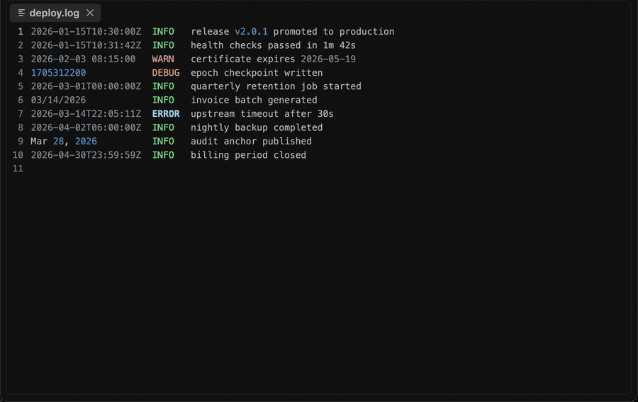

<p align="center">
  
</p>
<h1 align="center">Dates-LE: Zero Hassle Date Extraction</h1>
<p align="center">
  <b>Pull every date and timestamp out of the current file in one keystroke</b><br/>
  <i>JSON, YAML, CSV, XML, logs, HTML, JavaScript, and TypeScript</i>
</p>

<p align="center">
  <a href="https://marketplace.visualstudio.com/items?itemName=nolindnaidoo.dates-le">
    
  </a>
  <a href="https://open-vsx.org/extension/OffensiveEdge/dates-le">
    
  </a>
  <a href="https://www.npmjs.com/package/dates-le-mcp">
    
  </a>
  <a href="https://letools.dev/tools/dates-le">
    
  </a>
</p>

---

<p align="center">
  
</p>

> **Useful?** A star or rating is how other developers find it —
> [★ GitHub](https://github.com/nolindnaidoo/dates-le) ·
> [★ Open VSX](https://open-vsx.org/extension/OffensiveEdge/dates-le/reviews) ·
> [★ Marketplace](https://marketplace.visualstudio.com/items?itemName=nolindnaidoo.dates-le&ssr=false#review-details)

## What it does

Open a file, press `Ctrl+Alt+D` (`Cmd+Alt+D` on Mac), and every date in the document lands in a new editor — deduplicate, sort, analyze, convert, filter, or validate it from there. Works in VS Code and in VS Code–based editors like Cursor and VSCodium (installable from Open VSX).

- **Log analysis** — timestamps from server logs: ISO, syslog, and Apache access-log formats
- **Data review** — dates and epochs from JSON, YAML, CSV, and XML
- **Code audit** — date literals and `new Date()`/`Date.parse()`/`moment()`/`dayjs()`/`DateTime.fromISO()` arguments in JS/TS, including calls formatted across multiple lines

## Use it from an AI agent

The same engine runs as an [MCP](https://modelcontextprotocol.io) server, so an agent can call it directly instead of you running a command.

| Editor | How |
|---|---|
| **VS Code** 1.101+ | Nothing to install — the extension registers `extract_dates` with agent mode |
| **Zed** | [Dates-LE](https://github.com/zed-industries/extensions/pull/7079) — *pending review* |
| **Claude Code** | `claude mcp add dates-le -- npx -y dates-le-mcp` |
| **Cursor, Windsurf, anything else** | point it at `npx dates-le-mcp` |

```
extract_dates(content, format?, filename?, dedupe?, maxResults?)
```

Returns every date with its notation, epoch value where resolvable, and 1-based line and column, capped at 500 by default with `meta.truncated`.

The server takes content and returns data — it reads no files and makes no network requests of its own. Published as [`dates-le-mcp`](https://www.npmjs.com/package/dates-le-mcp) on npm and as `io.github.nolindnaidoo/dates-le` in the [MCP registry](https://registry.modelcontextprotocol.io).

<details>
<summary><b>Configuring it by hand</b> — any host with an MCP config file</summary>

Most hosts read a JSON config. Add one entry:

```json
{
  "mcpServers": {
    "dates-le": {
      "command": "npx",
      "args": ["-y", "dates-le-mcp"]
    }
  }
}
```

`-y` skips the install prompt on first run. Pin a version if you would rather not track releases — `dates-le-mcp@2.2.1`.

Prefer not to go through `npx` on every launch? Install it once and point at the binary instead:

```bash
npm install -g dates-le-mcp
```

```json
{
  "mcpServers": {
    "dates-le": { "command": "dates-le-mcp" }
  }
}
```

It speaks MCP over stdio and needs no environment variables, no API key and no configuration of its own. To check it before wiring it into anything:

```bash
echo '{"jsonrpc":"2.0","id":1,"method":"tools/list"}' | npx -y dates-le-mcp
```

That prints the tool list and exits — if you see `extract_dates`, the server works.

</details>

## Supported formats

| Format | Language IDs | What gets extracted |
|---|---|---|
| JSON | `json` | Every recognized date pattern in the content |
| YAML | `yaml`, `yml` | Every recognized date pattern in the content |
| CSV | `csv` | Every recognized date pattern, cell by cell |
| XML | `xml` | Date patterns outside comments (inline and multiline comments are skipped) |
| Log / plain text | `log`, `plaintext` | Everything above plus `YYYY-MM-DD HH:mm:ss` log lines, syslog (`Mon DD HH:mm:ss`), and Apache access-log timestamps |
| JavaScript / TypeScript | `javascript`, `javascriptreact`, `typescript`, `typescriptreact` | Everything above plus string arguments to `new Date()`, `Date.parse()`, `moment()`, `dayjs()`, `DateTime.fromISO()` |
| HTML | `html` | Everything above plus `datetime` attributes, date-bearing `<meta>` tags, and JSON-LD `datePublished`/`dateModified` |

Recognized date patterns: ISO 8601 (`2024-01-15T10:30:00Z`, with optional milliseconds and offset), RFC 2822 (`Mon, 15 Jan 2024 10:30:00 GMT`), Unix epochs (exactly 10 or 13 digits in a plausible range — digits embedded in longer numbers are never matched), UTC strings, US-style `M/D/YYYY HH:mm:ss`, and bare `YYYY-MM-DD`. Every occurrence is reported with its real line and column. Values that cannot be parsed to a timestamp are not extracted.

Known limitations: `M/D/YYYY` assumes US ordering; syslog lines carry no year, so the current year is assumed.

## Commands

| Command | Description |
|---|---|
| `Dates-LE: Extract Dates` (`Ctrl+Alt+D` / `Cmd+Alt+D`) | Extract all dates from the active document |
| `Dates-LE: Analyze Dates` | Statistics, patterns, clusters, gaps, and anomalies |
| `Dates-LE: Convert Dates` | Convert extracted dates to ISO, RFC 2822, Unix, UTC, local, simple, or a custom format |
| `Dates-LE: Filter Dates` | Filter by range, format, duplicates, future/past |
| `Dates-LE: Validate Dates` | Check extracted dates against selectable rules |
| `Dates-LE: Deduplicate Dates` | Remove duplicate lines from the results |
| `Dates-LE: Sort Dates` | Sort results chronologically or alphabetically |
| `Dates-LE: Open Settings` | Open Dates-LE settings |
| `Dates-LE: Help` | Built-in documentation |

## Settings

| Setting | Default | Description |
|---|---|---|
| `dates-le.openResultsSideBySide` | `true` | Open results beside the current editor |
| `dates-le.copyToClipboardEnabled` | `false` | Also copy results to the clipboard |
| `dates-le.notificationsLevel` | `silent` | `all` = every notification, `important` = warnings + errors, `silent` = errors only |
| `dates-le.safety.enabled` | `true` | Guardrails for very large files |
| `dates-le.safety.fileSizeWarnBytes` | `1000000` | Refuse extraction above this file size |
| `dates-le.statusBar.enabled` | `true` | Show the status bar item |
| `dates-le.telemetryEnabled` | `false` | Local-only event log (see Privacy) |

## Languages

Twelve languages besides English:

German · Spanish · French · Indonesian · Italian · Japanese · Korean ·
Portuguese (Brazil) · Russian · Ukrainian · Vietnamese · Chinese (Simplified)

Both halves are covered — the manifest (command titles, setting names and
descriptions) and everything shown while the extension runs (notifications,
the status bar, quick-picks and prompts). The extension follows VS Code's
display language, so it matches whatever the editor is already set to; no
setting of its own.

## Privacy & security

- **No network access.** The extension never sends data anywhere. The `telemetryEnabled` setting only writes events to a local Output Channel you can inspect (`Dates-LE Telemetry`).
- **The MCP server holds the same line.** It takes content as an argument and returns data: no filesystem access, no network calls, no telemetry. Your agent already has file-read tools, so duplicating them inside the server would add a path-traversal surface for no capability. `check:mcp-bundle` fails the build if the server ever imports something that could reach either.
- Error notifications redact home directories and credential-shaped fragments.

## Development

```bash
bun install
bun run build            # esbuild bundle -> dist/extension.js
bun run typecheck        # tsc --noEmit (includes tests)
bun run test             # vitest unit suite
bun run test:integration # real VS Code extension host
bun run lint             # biome
bun run package          # VSIX into release/
```

Architecture and conventions live in [AGENTS.md](AGENTS.md). Changes are tracked in [CHANGELOG.md](CHANGELOG.md).

## Performance

<!-- performance:start -->
| Input | Size | Found | Time | Rate | Scan speed |
| --- | --- | --- | --- | --- | --- |
| Server log (ISO) | 1.74 MB | 40,000 | 139.92 ms | 285,887/sec | 12.5 MB/s |
| JSON records | 1.42 MB | 25,000 | 82.75 ms | 302,132/sec | 17.2 MB/s |
| CSV export | 0.64 MB | 40,000 | 39.15 ms | 1,021,610/sec | 16.3 MB/s |

Median of 7 runs after warmup, on Apple M5 Pro, 24 GB RAM, Node 24.3.0. Inputs are generated
by `scripts/benchmark.ts` rather than checked in, so the sizes above are
exactly what was measured. Reproduce with `bun run benchmark`.

These are machine-specific and are not asserted in CI — a benchmark that gates
a build only tells you how busy the runner was.
<!-- performance:end -->

## Testing

<!-- coverage:start -->
| Metric | Coverage |
| --- | --- |
| Statements | 91.27% |
| Branches | 79.00% |
| Functions | 96.12% |
| Lines | 92.66% |

189 test cases across 17 files, plus an integration suite that runs
in a real VS Code extension host and an end-to-end test that installs the
built `.vsix` into a clean profile.

Generated from `coverage/coverage-summary.json` by
`scripts/coverage-readme.js`; CI fails if this section drifts from a fresh
run. Reproduce with `bun run test:coverage`.
<!-- coverage:end -->

## More from the LE Family

Every tool in the family, one page: **[letools.dev](https://letools.dev)**

All ten also ship as MCP servers — `npx <name>-mcp` gives any agent the same engine.

- **[Paths-LE](https://letools.dev/tools/paths-le)** - Extract file paths from JS/TS imports, JSON, HTML, CSS, TOML, CSV, and .env
- **[String-LE](https://letools.dev/tools/string-le)** - Extract string values for i18n from JSON, YAML, CSV, TOML, INI, and .env
- **[Numbers-LE](https://letools.dev/tools/numbers-le)** - Extract numeric values from JSON, YAML, CSV, TOML, INI, and .env
- **[EnvSync-LE](https://letools.dev/tools/envsync-le)** - Spot missing keys across your .env files, with a markdown report
- **[Regex-LE](https://letools.dev/tools/regex-le)** - Find, test, and validate regular expressions with ReDoS screening
- **[Secrets-LE](https://letools.dev/tools/secrets-le)** - Detect and sanitize credentials locally, before you commit
- **[Scrape-LE](https://letools.dev/tools/scrape-le)** - Check whether a page is scrapeable before you write the scraper
- **[Colors-LE](https://letools.dev/tools/colors-le)** - Extract and analyze colors from CSS, SCSS, LESS, Stylus, HTML, JS/TS, and SVG
- **[URLs-LE](https://letools.dev/tools/urls-le)** - Extract URLs from documentation, configs, and code

## Also by nolindnaidoo

**Rust**

- **[pixelcoords](https://github.com/nolindnaidoo/pixelcoords)** — Freeze your screen, mark regions, get pixel-exact coordinates and crops
  [pixelcoords.dev](https://pixelcoords.dev) · [crates.io](https://crates.io/crates/pixelcoords) · [docs.rs](https://docs.rs/pixelcoords)
- **[pixelactions](https://github.com/nolindnaidoo/pixelactions)** — Consume human-verified coordinates, perform the interaction, confirm it landed
  [pixelactions.dev](https://pixelactions.dev) · [crates.io](https://crates.io/crates/pixelactions) · [docs.rs](https://docs.rs/pixelactions)
- **[scrape-le](https://github.com/nolindnaidoo/scrape-le/tree/main/crate)** — Check whether a page is scrapeable before the scraper is written, from a terminal or an agent
  [crates.io](https://crates.io/crates/scrape-le)

**Contact Developer** — [nolindnaidoo.com](https://nolindnaidoo.com) · [GitHub](https://github.com/nolindnaidoo) · [LinkedIn](https://www.linkedin.com/in/nolindnaidoo/)

## License

MIT © [nolindnaidoo](https://github.com/nolindnaidoo)
