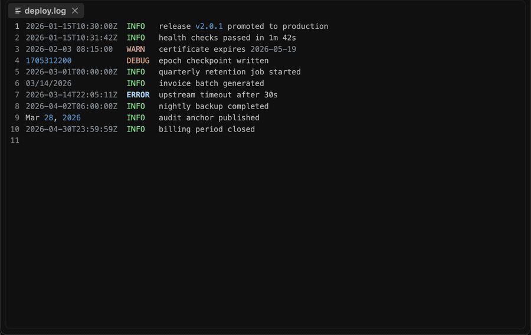

<p align="center">
  
</p>
<h1 align="center">Dates-LE: Zero Hassle Date Extraction</h1>
<p align="center">
  <b>Pull every date and timestamp out of the current file in one keystroke</b><br/>
  <i>Any text file — JSON, YAML, CSV, XML, TOML, Markdown, logs, HTML, JavaScript, TypeScript, Python, Go, and the rest</i>
</p>

<p align="center">
  <a href="https://marketplace.visualstudio.com/items?itemName=nolindnaidoo.dates-le">
    
  </a>
  <a href="https://open-vsx.org/extension/nolindnaidoo/dates-le">
    
  </a>
  <a href="https://www.npmjs.com/package/dates-le-mcp">
    
  </a>
  <a href="https://crates.io/crates/dates-le">
    
  </a>
  <a href="https://letools.dev/tools/dates-le">
    
  </a>
</p>

---

<p align="center">
  
</p>

> **Useful?** A star or rating is how other developers find it —
> [★ GitHub](https://github.com/nolindnaidoo/dates-le) ·
> [★ Open VSX](https://open-vsx.org/extension/nolindnaidoo/dates-le/reviews) ·
> [★ Marketplace](https://marketplace.visualstudio.com/items?itemName=nolindnaidoo.dates-le&ssr=false#review-details)

## What it does

Open a file, run `Dates-LE: Extract Dates`, and every date in the document lands in a new editor — deduplicate, sort, analyze, convert, filter, or validate it from there. Works in VS Code and in VS Code–based editors like Cursor and VSCodium (installable from Open VSX).

- **Log analysis** — timestamps from server logs: ISO, syslog, and Apache access-log formats
- **Data review** — dates and epochs from JSON, YAML, CSV, and XML
- **Code audit** — date literals and `new Date()`/`Date.parse()`/`moment()`/`dayjs()`/`DateTime.fromISO()` arguments in JS/TS, including calls formatted across multiple lines

## Install

| Where | What you get | Install |
|---|---|---|
| **VS Code** | The extraction, in your editor, on a keystroke | [Marketplace](https://marketplace.visualstudio.com/items?itemName=nolindnaidoo.dates-le) |
| **Cursor, VSCodium, Windsurf** | The same extension | [Open VSX](https://open-vsx.org/extension/nolindnaidoo/dates-le) |
| **A terminal or a CI step** | The same run over a whole tree, with exit codes | `cargo install dates-le` · [crates.io](https://crates.io/crates/dates-le) |
| **Any MCP agent, via Node** | `extract_dates` over stdio | `npx dates-le-mcp` · [npm](https://www.npmjs.com/package/dates-le-mcp) |

## Use it from an AI agent

The same engine runs as an [MCP](https://modelcontextprotocol.io) server, so an agent can call it directly instead of you running a command.

| Editor | How |
|---|---|
| **VS Code** 1.101+ | Nothing to install — the extension registers `extract_dates` with agent mode |
| **Claude Code** | `claude mcp add dates-le -- npx -y dates-le-mcp` |
| **Cursor, Windsurf, anything else** | point it at `npx dates-le-mcp` |

```
extract_dates(content, format?, filename?, dedupe?, dateOrder?, kinds?, maxResults?)
```

Returns every date with its notation, epoch value where resolvable, and 1-based line and column, capped at 500 by default with `meta.truncated`. `dateOrder` (`mdy` or `dmy`, default `mdy`) decides a numeric date such as `05/01/2024` that could be read either way round. `kinds` chooses which kinds of date come back, and leaves `unix` out unless it is listed.

The server takes content and returns data — it reads no files and makes no network requests of its own. Published as [`dates-le-mcp`](https://www.npmjs.com/package/dates-le-mcp) on npm and as `io.github.nolindnaidoo/dates-le` in the [MCP registry](https://registry.modelcontextprotocol.io).

<details>
<summary><b>Configuring it by hand</b> — any host with an MCP config file</summary>

Most hosts read a JSON config. Add one entry:

```json
{
  "mcpServers": {
    "dates-le": {
      "command": "npx",
      "args": ["-y", "dates-le-mcp"]
    }
  }
}
```

`-y` skips the install prompt on first run. Pin a version if you would rather not track releases — `dates-le-mcp@2.5.0`.

Prefer not to go through `npx` on every launch? Install it once and point at the binary instead:

```bash
npm install -g dates-le-mcp
```

```json
{
  "mcpServers": {
    "dates-le": { "command": "dates-le-mcp" }
  }
}
```

It speaks MCP over stdio and needs no environment variables, no API key and no configuration of its own. To check it before wiring it into anything:

```bash
echo '{"jsonrpc":"2.0","id":1,"method":"tools/list"}' | npx -y dates-le-mcp
```

That prints the tool list and exits — if you see `extract_dates`, the server works.

</details>

## Supported formats

| Format | Language IDs | What gets extracted |
|---|---|---|
| JSON | `json` | Every recognized date pattern in the content |
| YAML | `yaml`, `yml` | Every recognized date pattern in the content |
| CSV | `csv` | Every recognized date pattern, cell by cell |
| XML | `xml` | Date patterns outside comments (inline and multiline comments are skipped) |
| Log / plain text | `log`, `plaintext` | Everything above plus `YYYY-MM-DD HH:mm:ss` log lines, syslog (`Mon DD HH:mm:ss`), and Apache access-log timestamps |
| JavaScript / TypeScript | `javascript`, `javascriptreact`, `typescript`, `typescriptreact` | Everything above plus string arguments to `new Date()`, `Date.parse()`, `moment()`, `dayjs()`, `DateTime.fromISO()` |
| HTML | `html` | Everything above plus `datetime` attributes, date-bearing `<meta>` tags, and JSON-LD `datePublished`/`dateModified` |
| TOML / Markdown | `toml`, `markdown`, `md` | Every recognized date pattern in the content |
| INI / properties | `ini`, `cfg`, `conf`, `properties` | Every recognized date pattern in the content |
| **Anything else** | every other language ID | Every recognized date pattern in the content |

**Every document is read.** A format only ever *adds* patterns to the shared ones, so a language ID this does not name — Python, Go, Rust, shell, SQL — is scanned with the shared patterns rather than refused. What it does not get is the format-specific extras: `Jan 15 10:30:47` is a date in a log file and three words in a Python one.

Recognized date patterns: ISO 8601 in extended (`2024-01-15T10:30:00Z`, with optional milliseconds and offset), **basic** (`20240115`, `20240115T103045Z`), **week** (`2024-W03`, `2024-W03-1`) and **ordinal** (`2024-015`) form; RFC 2822 (`Mon, 15 Jan 2024 10:30:00 GMT`); Unix epochs in seconds, milliseconds, microseconds and nanoseconds, **when `dates-le.kinds` includes `unix`** (exactly 10, 13, 16 or 19 digits that land between 2001-09-09 and 2100, so a phone number, a request id or a card number is not a date in the 2100s or 2200s; digits embedded in a longer number, in a longer word such as a commit hash, or in the fraction of a float are never matched at all); UTC strings; bare `YYYY-MM-DD`; numeric dates with the day or the month first, separated by `/`, `.` or `-` (`15/01/2024`, `1/15/2024`, `15.01.2024 14:00`, `15-01-2024 3:30 PM`), with an optional time; and dates with the month written out (`15 January 2024`, `3rd Feb. 2024`, `Jan 15, 2024`, `15-JAN-2024`). A numeric date is read the one way it can be when a number is over 12; only when both could be a month does `dates-le.dateOrder` decide, and dotted dates are always day first. Every numeric or written date is checked against the calendar, so `31/02/2024` is not a date, and a numeric year must fall within 1900–2099. Every occurrence is reported with its real line and column. Values that cannot be resolved to a timestamp are not extracted.

Timezone names are the fixed offsets `GMT`/`UT`/`UTC`/`Z`, the eight US abbreviations, and `CEST`, `CET`, `BST`, `JST`, `AEST`, `IST`. They are fixed, not zone-aware.

Known limitations: an ambiguous numeric date follows `dates-le.dateOrder`, which is month first unless you change it; written-out months are English only; syslog lines carry no year, so the current year is assumed; `IST` names three different zones and is read as India's `+05:30`; a bare 8-digit run is only a date inside 1900–2099, and a 10-digit number inside the epoch window cannot be told from a Unix time, which is why that kind is off unless you turn it on.

## Across a folder or a workspace

Extract reads the document you have open. A scan reads many files from disk and gives one report: the project's dates, in time order.

- **The whole workspace**: run `Dates-LE: Extract Dates from Workspace` from the command palette.
- **One folder**: right-click it in the Explorer and choose `Extract Dates from Folder`, or run `Dates-LE: Extract Dates from Folder` and pick one.

Each date is listed once however it is spelled, the earliest first, with the spellings, how often it is written and where:

```markdown
# Dates-LE workspace report

`my-project` · 3 file(s) read · 3 distinct date(s), 5 occurrence(s) in 3 file(s)

| Date | Written as | Occurrences | Files | Where |
|---|---|---|---|---|
| `2024-01-15` | `2024-01-15`, `2024-01-15T00:00:00Z`, `January 15, 2024` | 3 | 2 | |
| `2024-03-01T08:30:00Z` | `2024-03-01T10:30:00+02:00` | 1 | 1 | `data/events.json` · **2:13** |
| `2025-12-31` | `2025-12-31` | 1 | 1 | `docs/release.md` · **2:14** |

## `2024-01-15` (3)

- `docs/release.md` · **1:9**, **1:31**
- `src/config.ts` · **1:17**
```

**The same date is one row.** `2024-01-15`, `2024-01-15T00:00:00Z` and `January 15, 2024` are one date written three ways, and the table says so. A date written with a time zone is a moment and is named in UTC, with the offset it was written with left in the "Written as" column. One written without a zone is named by what was written, so it is the same date on every machine. An ambiguous date such as `03/04/2024` is read the way `dates-le.dateOrder` says.

Every date is in the table. One written once is placed in its row. A repeated one gets a section below that lists each place.

That is with `dates-le.showPositions` on. It is off by default, and then each place is the file and how many times the date is in it: `docs/release.md (2)`. The copy on the clipboard follows `dates-le.clipboardIncludesPositions`, as it does for Extract.

**What a scan reads.** Files come from disk, so an unsaved edit is not seen. A file over the safety size, or one that is not UTF-8 text, is left unread. It stops at 5,000 files or 10,000 listed occurrences. The report ends with a line for each thing it left out, so a short report is never mistaken for a clean project.

**What it skips, and how to change that.** Three switches are on by default, and each can be turned off on its own in Settings:

| Switch | Skips |
|---|---|
| `scanUseDefaultExcludes` | Dependency folders, build output, tool caches and lockfiles. The full list is below |
| `scanRespectGitignore` | Whatever the project's `.gitignore` files skip |
| `scanSkipBinaryFiles` | Images, fonts, archives and other files that are not text |

Two lists adjust the result without turning a switch off. To skip more, add a pattern to `scanExcludes`. To read something a switch would skip, add it to `scanAlwaysInclude`:

```jsonc
{
	// Also skip the test fixtures.
	"dates-le.workspace.scanExcludes": ["**/fixtures/**"],
	// Read the vendored code, though the built-in list skips it.
	"dates-le.workspace.scanAlwaysInclude": ["**/vendor/**"]
}
```

`Dates-LE: Open Settings` opens all of these in the Settings editor.

<details>
<summary>The built-in list</summary>

Folders, wherever they appear:

<!-- built-in-folders -->
`.git`, `.hg`, `.svn`, `node_modules`, `bower_components`, `jspm_packages`, `.pnpm-store`, `.yarn`, `vendor`, `site-packages`, `Pods`, `Carthage`, `dist`, `build`, `out`, `target`, `_build`, `_site`, `dist-newstyle`, `zig-out`, `storybook-static`, `cdk.out`, `DerivedData`, `CMakeFiles`, `.next`, `.nuxt`, `.output`, `.svelte-kit`, `.angular`, `.astro`, `.docusaurus`, `.vuepress`, `.expo`, `.turbo`, `.parcel-cache`, `.cache`, `.sass-cache`, `.jekyll-cache`, `.dart_tool`, `.pub-cache`, `.gradle`, `.kotlin`, `.cxx`, `.externalNativeBuild`, `captures`, `ephemeral`, `.symlinks`, `.swiftpm`, `.build`, `.bundle`, `.stack-work`, `.zig-cache`, `.godot`, `elm-stuff`, `.vercel`, `.netlify`, `.serverless`, `.aws-sam`, `.terraform`, `.venv`, `venv`, `__pycache__`, `.tox`, `.nox`, `.mypy_cache`, `.pytest_cache`, `.ruff_cache`, `.ipynb_checkpoints`, `.eggs`, `coverage`, `htmlcov`, `.nyc_output`, `.vscode-test`, `.idea`, `.vs`, `xcuserdata`, `*.egg-info`
<!-- /built-in-folders -->

Files, wherever they appear:

<!-- built-in-files -->
`*.min.js`, `*.min.css`, `*.map`, `*.snap`, `*.lock`, `package-lock.json`, `pnpm-lock.yaml`, `npm-shrinkwrap.json`, `go.sum`, `*.pbxproj`, `*.iml`, `local.properties`, `output-metadata.json`, `.flutter-plugins`, `.flutter-plugins-dependencies`, `.packages`, `Generated.xcconfig`, `flutter_export_environment.sh`, `GeneratedPluginRegistrant.*`, `fastlane/report.xml`, `fastlane/test_output/**`, `doc/api/**`
<!-- /built-in-files -->

Not on the list, because they are ordinary folders in many projects: `bin`, `obj`, `tmp`, `logs`, `public`, `generated`. A project that generates those ignores them in git, and the scan reads `.gitignore`.

</details>

The settings that shape a scan are under [Settings](#settings).

## The CLI

The same extraction runs from a terminal or a CI step: a Rust CLI in
[`crate/`](crate/README.md), sharing one corpus with the extension —
[`crate/fixtures/`](crate/fixtures/) — so the two can never read a
document differently.

```bash
dates-le .                          # every date in the tree, as JSON
dates-le --before 2026-01-01 .      # everything already in the past
dates-le --sort --iso config/       # ordered by instant, in readable form
dates-le mcp                        # the same extraction over MCP on stdio
```

**The instant is the point.** `2024-01-15`, `1705276800` and
`Mon, 15 Jan 2024` are one moment written three ways, and resolving each
to a number is what makes them sortable and comparable rather than three
strings to read. Resolution matches `Date.parse` in V8 exactly — legacy
parser included — against 178 cases taken from V8 itself.

A date with no timezone resolves against the machine's, because that is
the true answer and it genuinely differs by machine. `TZ` is honoured.

## Choosing which kinds of date are extracted

`dates-le.kinds` is a checklist of the kinds of date every command picks up. A kind left out is not reported, in Extract, in a folder or workspace scan, and in Analyze, Convert, Filter and Validate.

| Kind | Reads | Default |
|---|---|---|
| `iso` | `2024-01-15T10:30:00Z` | On |
| `simple` | `2024-01-15` | On |
| `local` | `01/15/2024`, `January 15, 2024` | On |
| `rfc2822` | `Mon, 15 Jan 2024 10:30:00 GMT` | On |
| `utc` | `Mon Jan 15 2024 10:30:00 GMT+0000` | On |
| `week` | `2024-W03` | On |
| `ordinal` | `2024-015` | On |
| `basic` | `20240115` | On |
| `custom` | Dates a file type marks: log lines, HTML `datetime` attributes, `new Date("…")` | On |
| `unix` | `1705314645` | **Off** |

**Unix time is off by default.** It is the one kind that does not look like a date: any ten-digit number in the right range is one, and so is an id or a phone number of the same length. Turn it on when you are reading logs or data that carry them:

```jsonc
{
	"dates-le.kinds": ["iso", "simple", "local", "rfc2822", "utc", "week", "ordinal", "basic", "custom", "unix"]
}
```

The MCP tool and the CLI take the same list, as a `kinds` argument and a `--kinds` flag, and leave `unix` out by default as the extension does.

## Commands

| Command | Description |
|---|---|
| `Dates-LE: Extract Dates` | Extract all dates from the active document |
| `Dates-LE: Extract Dates from Workspace` | Every date in every file in the workspace, in time order: each date once, with its spellings and where it is |
| `Dates-LE: Extract Dates from Folder` | The same for one folder. Also on a folder in the Explorer |
| `Dates-LE: Analyze Dates` | Statistics, patterns, clusters, gaps, and anomalies |
| `Dates-LE: Convert Dates` | Convert extracted dates to ISO, RFC 2822, Unix, UTC, local, simple, or a custom format |
| `Dates-LE: Filter Dates` | Filter by range, format, duplicates, future/past |
| `Dates-LE: Validate Dates` | Check extracted dates against selectable rules |
| `Dates-LE: Deduplicate Dates` | Remove duplicate lines from the results |
| `Dates-LE: Sort Dates` | Sort results chronologically or alphabetically |
| `Dates-LE: Open Settings` | Open Dates-LE settings |
| `Dates-LE: Help` | Built-in documentation |

No command is bound to a key by default. Give any of them one under **Keyboard Shortcuts** in the editor.

## Settings

| Setting | Default | Description |
|---|---|---|
| `dates-le.openResultsSideBySide` | `true` | Open results beside the current editor |
| `dates-le.showPositions` | `false` | Show the line and column of each date |
| `dates-le.copyToClipboardEnabled` | `false` | Also copy results to the clipboard |
| `dates-le.clipboardIncludesPositions` | `false` | Include the line and column in that copy |
| `dates-le.dateOrder` | `mdy` | How to read a numeric date that could be either way round: `mdy` reads `05/01/2024` as 1 May, `dmy` as 5 January |
| `dates-le.kinds` | `iso`, `simple`, `local`, `rfc2822`, `utc`, `week`, `ordinal`, `basic`, `custom` | The kinds of date to extract. Add `unix` to read bare numbers such as `1705314645` as dates |
| `dates-le.notificationsLevel` | `silent` | `all` = every notification, `important` = warnings + errors, `silent` = errors only |
| `dates-le.workspace.scanPatterns` | `["**/*"]` | The files a folder or workspace scan reads |
| `dates-le.workspace.scanUseDefaultExcludes` | `true` | Skip dependency folders, build output, caches and lockfiles |
| `dates-le.workspace.scanRespectGitignore` | `true` | Skip what the project's `.gitignore` files skip |
| `dates-le.workspace.scanSkipBinaryFiles` | `true` | Skip images, fonts, archives and other files that are not text |
| `dates-le.workspace.scanExcludes` | `[]` | More files to skip, as glob patterns |
| `dates-le.workspace.scanAlwaysInclude` | `[]` | Files to read even when one of the three above would skip them |
| `dates-le.workspace.scanMaxFiles` | `5000` | The most files one scan reads |
| `dates-le.workspace.scanMaxResults` | `10000` | The most occurrences one scan lists before it stops reading |
| `dates-le.safety.enabled` | `true` | Guardrails for very large files |
| `dates-le.safety.fileSizeWarnBytes` | `1000000` | Refuse extraction above this file size |
| `dates-le.statusBar.enabled` | `true` | Show the status bar item |
| `dates-le.telemetryEnabled` | `false` | Local-only event log (see Privacy) |

## Languages

Twelve languages besides English:

German · Spanish · French · Indonesian · Italian · Japanese · Korean ·
Portuguese (Brazil) · Russian · Ukrainian · Vietnamese · Chinese (Simplified)

Both halves are covered — the manifest (command titles, setting names and
descriptions) and everything shown while the extension runs (notifications,
the status bar, quick-picks and prompts). The extension follows VS Code's
display language, so it matches whatever the editor is already set to; no
setting of its own.

## Privacy & security

- **No network access.** The extension never sends data anywhere. The `telemetryEnabled` setting only writes events to a local Output Channel you can inspect (`Dates-LE Telemetry`).
- **The MCP server holds the same line.** It takes content as an argument and returns data: no filesystem access, no network calls, no telemetry. Your agent already has file-read tools, so duplicating them inside the server would add a path-traversal surface for no capability. `check:mcp-bundle` fails the build if the server ever imports something that could reach either.
- Error notifications redact home directories and credential-shaped fragments.
- **One rating prompt, at most twice.** After 3 successful uses, on at least the second day you use it, the extension asks once whether you would rate it, and once more on the 25th use if you chose *Later* or dismissed it. *Don't Ask Again* ends it. Setting `notificationsLevel` to `important` or `silent` yourself turns it off. The counts are kept in VS Code's extension storage and nothing is sent anywhere; *Rate* opens the listing you installed from — the VS Code Marketplace or Open VSX — in your browser.

## Documentation

| What | Where |
|---|---|
| What the tool is allowed to say — scope, output contract, refusals, non-goals | [`crate/SPEC.md`](crate/SPEC.md) |
| How the extension is built and held together — architecture, invariants, toolchain, release | [AGENTS.md](AGENTS.md) |
| How the CLI is built and held together | [`crate/AGENTS.md`](crate/AGENTS.md) |
| What changed | [CHANGELOG.md](CHANGELOG.md) · [`crate/CHANGELOG.md`](crate/CHANGELOG.md) |
| The tool's page, and the other fifteen | [letools.dev/tools/dates-le](https://letools.dev/tools/dates-le) |

## Performance

<!-- performance:start -->
| Input | Size | Found | Time | Rate | Scan speed |
| --- | --- | --- | --- | --- | --- |
| Server log (ISO) | 1.74 MB | 40,000 | 139.92 ms | 285,887/sec | 12.5 MB/s |
| JSON records | 1.42 MB | 25,000 | 82.75 ms | 302,132/sec | 17.2 MB/s |
| CSV export | 0.64 MB | 40,000 | 39.15 ms | 1,021,610/sec | 16.3 MB/s |

Median of 7 runs after warmup, on Apple M5 Pro, 24 GB RAM, Node 24.3.0. Inputs are generated
by `scripts/benchmark.ts` rather than checked in, so the sizes above are
exactly what was measured. Reproduce with `bun run benchmark`.

These are machine-specific and are not asserted in CI — a benchmark that gates
a build only tells you how busy the runner was.
<!-- performance:end -->

## Testing

<!-- coverage:start -->
| Metric | Coverage |
| --- | --- |
| Statements | 92.84% |
| Branches | 84.00% |
| Functions | 97.29% |
| Lines | 94.14% |

360 test cases across 28 files, plus an integration suite that runs
in a real VS Code extension host and an end-to-end test that installs the
built `.vsix` into a clean profile.

Generated from a real run — `coverage/coverage-summary.json` and
`coverage/test-results.json` — by `scripts/coverage-readme.js`; CI fails if
this section drifts. Reproduce with `bun run test:coverage`, and the case
count is the one vitest prints.
<!-- coverage:end -->

## More from the LE family

Sixteen single-purpose tools for the work in front of every model. Each ships
a Rust CLI and an MCP server. One page: **[letools.dev](https://letools.dev)**

**Get it out**

- **[String-LE](https://letools.dev/tools/string-le)** — Extract every string in a codebase, with its position, so a person can read them
- **[Numbers-LE](https://letools.dev/tools/numbers-le)** — Extract every hardcoded number in a codebase, so a person can check them
- **[Units-LE](https://letools.dev/tools/units-le)** — Extract every quantity with its unit, normalized, and refuse the ambiguous ones by name
- **[Dates-LE](https://letools.dev/tools/dates-le)** — Extract every date and timestamp, and the exact instant each one resolves to
- **[IDs-LE](https://letools.dev/tools/ids-le)** — Extract every UUID, ULID, NanoID, ObjectId and Snowflake, and decode the time inside
- **[IPs-LE](https://letools.dev/tools/ips-le)** — Extract every IP address, CIDR block and MAC, normalized and classified by scope
- **[URLs-LE](https://letools.dev/tools/urls-le)** — Extract every URL in a codebase, with its protocol and exact position
- **[Paths-LE](https://letools.dev/tools/paths-le)** — Extract every file path in a codebase, and say whether it still points at anything
- **[Colors-LE](https://letools.dev/tools/colors-le)** — Extract every color in a codebase, and say which ones are not in your palette

**Check it**

- **[Regex-LE](https://letools.dev/tools/regex-le)** — Find every regex in a codebase, and report which can be driven into catastrophic backtracking
- **[Versions-LE](https://letools.dev/tools/versions-le)** — Find where one dependency is constrained differently across a repository's manifests
- **[i18n-LE](https://letools.dev/tools/i18n-le)** — Identify the i18n library a project uses, then audit its catalogs by that library's rules
- **[Scrape-LE](https://letools.dev/tools/scrape-le)** — Check whether a page is scrapeable before the scraper is written, and say when it cannot tell

**Guard it**

- **[Secrets-LE](https://letools.dev/tools/secrets-le)** — Find hardcoded credentials in a codebase, and never print one into the report
- **[EnvSync-LE](https://letools.dev/tools/envsync-le)** — Compare the dotenv files in a tree, and say which keys are missing from which
- **[Unicode-LE](https://letools.dev/tools/unicode-le)** — Find the Unicode that hides meaning — bidi controls, invisibles, homoglyphs, mixed scripts

Each stands on its own: no shared crate, no published core. Where two of them
agree, it is because the same answer was right twice.

**Contact** — [nolindnaidoo.com](https://nolindnaidoo.com) · [GitHub](https://github.com/nolindnaidoo) · [LinkedIn](https://www.linkedin.com/in/nolindnaidoo/)

## Also by nolindnaidoo

**Rust** — pixelcoords and pixelactions are one loop: pixelcoords answers
*where*, pixelactions *acts* there. Their own tools, their own voice — not
part of the LE family.

- **[pixelcoords](https://github.com/nolindnaidoo/pixelcoords)** — Freeze your screen, mark regions, get pixel-exact coordinates and crops
  [pixelcoords.dev](https://pixelcoords.dev) · [crates.io](https://crates.io/crates/pixelcoords) · [docs.rs](https://docs.rs/pixelcoords)
- **[pixelactions](https://github.com/nolindnaidoo/pixelactions)** — Consume human-verified coordinates, perform the interaction, confirm it landed
  [pixelactions.dev](https://pixelactions.dev) · [crates.io](https://crates.io/crates/pixelactions) · [docs.rs](https://docs.rs/pixelactions)

## License

MIT © [nolindnaidoo](https://github.com/nolindnaidoo)
