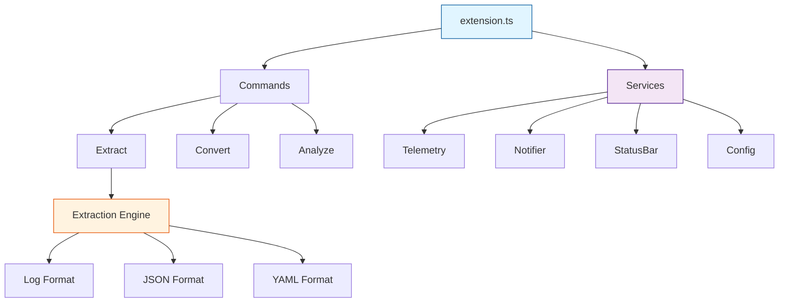
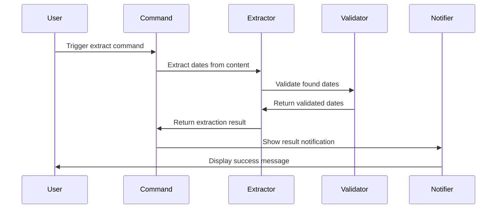

# Dates-LE Architecture

## Design Principles

**Functional First**: Pure functions with `readonly` types and `Object.freeze()` for immutability. Factory functions replace classes for component creation.

**Developer Empathy**: Unobtrusive defaults, subtle status bar feedback, graceful error degradation, and local-only processing with no external dependencies.

**Immutability**: All exports frozen, readonly interfaces throughout, immutable configuration objects, and safe error handling without side effects.

## System Architecture



## Component Responsibilities

### 1. Extension Entry (`src/extension.ts`)

Minimal activation with dependency injection:

```typescript
export function activate(context: vscode.ExtensionContext): void {
  const telemetry = createTelemetry()
  const notifier = createNotifier()
  const statusBar = createStatusBar(context)

  registerCommands(context, { telemetry, notifier, statusBar })

  telemetry.event('extension-activated')
}
```

**Role**: Wire services, register commands, manage disposables.

### 2. Command System (`src/commands/`)

Factory pattern with dependency injection:

```typescript
export function registerExtractCommand(
  context: vscode.ExtensionContext,
  deps: Readonly<{ telemetry; notifier; statusBar }>,
): void {
  const disposable = vscode.commands.registerCommand('dates-le.extract', async () => {
    const config = readConfiguration()
    const content = getActiveEditorContent()

    await vscode.window.withProgress(
      {
        location: vscode.ProgressLocation.Notification,
        title: 'Extracting dates...',
      },
      async () => {
        const result = await extractDates(content, config)
        deps.notifier.show(result.summary)
      },
    )
  })

  context.subscriptions.push(disposable)
}
```

**Commands**: `extract`, `convert`, `analyze`, `help`, `openSettings`

### 3. Configuration (`src/config/`)

Frozen configuration with type safety:

```typescript
export function readConfiguration(): Readonly<Configuration> {
  const config = vscode.workspace.getConfiguration('dates-le')

  return Object.freeze({
    defaultOutputFormat: config.get('defaultOutputFormat', 'iso8601'),
    includeRelativeDates: config.get('includeRelativeDates', true),
    safetyEnabled: config.get('safety.enabled', true),
    safetyFileSizeWarnBytes: config.get('safety.fileSizeWarnBytes', 1000000),
  })
}
```

**Features**: Immutable objects, real-time updates via `onDidChangeConfiguration`, type-safe access.

### 4. Extraction Engine (`src/extraction/`)

Format-specific extractors with pure functions:

```typescript
export function extractDates(content: string, format: FileFormat): Readonly<ExtractionResult> {
  const extractor = getExtractor(format)
  const dates = extractor.extract(content)

  return Object.freeze({
    dates: Object.freeze(dates),
    format,
    totalCount: dates.length,
    timestamp: Date.now(),
  })
}
```

**Supported Formats**: Log files, JSON, YAML, CSV, plain text

**Process**: Format detection → Pattern matching → Validation → Normalization → Result freezing

### 5. Utility Services (`src/utils/`)

**Error Handling**: Categorization, recovery actions, user notifications
**Performance Monitoring**: Threshold tracking, metrics collection, cancellation support
**Localization**: MessageFormat integration, parameter substitution

## Data Flow

### Date Extraction Pipeline



### Error Handling Flow

1. Error occurs during processing
2. Categorize by type (parsing, validation, file-system)
3. Determine severity (info, warning, error, critical)
4. Select recovery action (retry, skip, abort, user-input)
5. Notify user appropriately
6. Log to telemetry (local only)

## Service Dependencies

### Dependency Injection Pattern

```typescript
interface CommandDependencies {
  readonly telemetry: Telemetry
  readonly notifier: Notifier
  readonly statusBar: StatusBar
  readonly localizer: Localizer
  readonly performanceMonitor: PerformanceMonitor
  readonly errorHandler: ErrorHandler
}

export function registerCommands(
  context: vscode.ExtensionContext,
  deps: Readonly<CommandDependencies>,
): void {
  // Register all commands with dependencies
}
```

**Why**: Enables testing with mocks, clear dependency graph, loose coupling between components.

## File Organization

```
src/
├── extension.ts          # Activation entry point
├── types.ts              # Centralized type definitions
├── commands/             # Command implementations
│   ├── extract.ts
│   ├── convert.ts
│   └── analyze.ts
├── config/               # Configuration management
│   └── config.ts
├── extraction/           # Date extraction logic
│   ├── extract.ts
│   └── formats/
│       ├── log.ts
│       ├── json.ts
│       └── yaml.ts
├── utils/                # Utility services
│   ├── errorHandling.ts
│   ├── performance.ts
│   └── localization.ts
├── ui/                   # User interface
│   ├── notifier.ts
│   └── statusBar.ts
└── telemetry/            # Local telemetry
    └── telemetry.ts
```

## Performance Strategy

**Memory**: Streaming for large files, efficient algorithms, memory cleanup, configurable thresholds
**CPU**: Lazy evaluation, caching frequent data, background processing, cancellation support
**I/O**: Chunked reading, progress indication, safety checks, user confirmation

## Security & Privacy

**Local-Only**: No external network requests, no data collection, local telemetry only, VS Code workspace trust compliance
**Input Validation**: Safe parsing, sanitized input, injection prevention, resource limits

## Testing Approach

**Coverage Target**: 80% minimum across branches, functions, lines, statements
**Test Types**: Unit (pure functions), integration (workflows), performance (large files), error handling (edge cases)
**Framework**: Vitest with V8 coverage provider

## Design Rationale

### Why Factory Functions Over Classes?

- **Simpler**: No `this` context, no inheritance hierarchies
- **Testable**: Easy to mock and inject dependencies
- **Immutable**: Natural fit with frozen return values
- **Composable**: Functions compose better than classes

### Why Object.freeze() Everywhere?

- **Safety**: Prevents accidental mutation bugs
- **Intent**: Communicates immutability contract
- **Performance**: V8 optimizes frozen objects
- **Reliability**: Easier to reason about data flow

### Why Local-Only Telemetry?

- **Privacy**: User data never leaves VS Code
- **Trust**: No external dependencies or network calls
- **Simplicity**: No servers or tracking infrastructure
- **Compliance**: Aligns with VS Code telemetry guidelines

---

**Related:** [Commands](COMMANDS.md) | [Configuration](CONFIGURATION.md) | [Testing](TESTING.md) | [Performance](PERFORMANCE.md)
