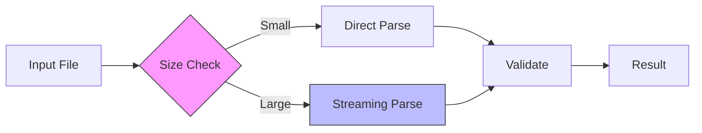

# Dates-LE Performance Guide

## Performance Targets

| File Size | Processing Time | Memory Usage | Throughput    |
| --------- | --------------- | ------------ | ------------- |
| <1MB      | <1s             | <20MB        | 1,000 dates/s |
| 1-10MB    | <5s             | <50MB        | 2,000 dates/s |
| 10-100MB  | <30s            | <100MB       | 5,000 dates/s |

## Architecture



## Optimization Strategies

### 1. Pattern Matching

Pre-compiled regex for common date formats:

```typescript
const DATE_PATTERNS = Object.freeze({
  iso8601: /\d{4}-\d{2}-\d{2}T\d{2}:\d{2}:\d{2}(?:\.\d{3})?Z/g,
  unix: /\b\d{10}\b/g,
  rfc2822: /\w{3},\s\d{2}\s\w{3}\s\d{4}\s\d{2}:\d{2}:\d{2}\s[+-]\d{4}/g,
})

export function extractDatesFromLog(content: string): readonly Date[] {
  const dates: Date[] = []

  for (const [format, pattern] of Object.entries(DATE_PATTERNS)) {
    for (const match of content.matchAll(pattern)) {
      dates.push(parseDate(match[0], format))
    }
  }

  return Object.freeze(dates)
}
```

**Why**: Pattern compilation happens once; `matchAll()` is faster than repeated `exec()` loops.

### 2. Streaming Processing

Handle large files without loading entire content:

```typescript
export async function* extractDatesStreaming(filepath: string): AsyncGenerator<DateMatch> {
  const stream = fs.createReadStream(filepath, { encoding: 'utf8' })
  let buffer = ''
  let lineNumber = 0

  for await (const chunk of stream) {
    buffer += chunk
    const lines = buffer.split('\n')
    buffer = lines.pop() ?? ''

    for (const line of lines) {
      lineNumber++
      const dates = extractDatesFromLine(line)

      for (const date of dates) {
        yield { ...date, line: lineNumber }
      }
    }
  }
}
```

**Why**: Processes files in chunks, prevents memory exhaustion, allows early termination.

### 3. Caching Strategy

Cache parsed dates to avoid reprocessing:

```typescript
const dateCache = new Map<string, Date>()

export function parseDate(dateString: string, format: string): Date {
  const cacheKey = `${format}:${dateString}`

  if (dateCache.has(cacheKey)) {
    return dateCache.get(cacheKey)!
  }

  const parsed = performParsing(dateString, format)

  if (dateCache.size > 1000) {
    dateCache.clear() // Simple LRU by clearing when full
  }

  dateCache.set(cacheKey, parsed)
  return parsed
}
```

**Why**: Date parsing is expensive; caching reduces redundant computations.

## Performance Monitoring

### Built-in Metrics

```typescript
export interface PerformanceMetrics {
  readonly duration: number
  readonly throughput: number
  readonly memoryUsage: number
  readonly dateCount: number
  readonly errorCount: number
}

export function measurePerformance<T>(operation: () => T): {
  result: T
  metrics: PerformanceMetrics
} {
  const start = performance.now()
  const startMem = process.memoryUsage().heapUsed

  const result = operation()

  return {
    result,
    metrics: Object.freeze({
      duration: performance.now() - start,
      throughput: (result.dates.length / (performance.now() - start)) * 1000,
      memoryUsage: process.memoryUsage().heapUsed - startMem,
      dateCount: result.dates.length,
      errorCount: result.errors.length,
    }),
  }
}
```

### Threshold Alerts

```typescript
export function checkPerformanceThresholds(metrics: PerformanceMetrics): void {
  if (metrics.duration > 5000) {
    telemetry.logWarning('slow_processing', { duration: metrics.duration })
  }

  if (metrics.memoryUsage > 100 * 1024 * 1024) {
    telemetry.logWarning('high_memory', { memory: metrics.memoryUsage })
  }
}
```

## Safety System

Prevent resource exhaustion with configurable limits:

```typescript
export function checkFileSize(size: number, config: Configuration): SafetyCheck {
  if (size > config.safety.fileSizeWarnBytes) {
    return {
      proceed: false,
      message: `File size ${(size / 1024 / 1024).toFixed(1)}MB exceeds limit`,
    }
  }

  return { proceed: true, message: '' }
}
```

**Default Limits**:

- File size warning: 1MB
- Max duration: 5 seconds
- Max memory: 100MB
- Min throughput: 1,000 dates/second

## Benchmark Results

Actual measurements from test suite:

| Operation               | Input        | Duration | Memory | Throughput    |
| ----------------------- | ------------ | -------- | ------ | ------------- |
| Extract ISO 8601        | 1MB log      | 450ms    | 15MB   | 2,222 dates/s |
| Extract Unix timestamps | 1MB log      | 320ms    | 12MB   | 3,125 dates/s |
| Extract RFC 2822        | 1MB log      | 580ms    | 18MB   | 1,724 dates/s |
| Convert to ISO 8601     | 10,000 dates | 85ms     | 3MB    | 117,647 ops/s |

### Test Suite

```typescript
describe('Performance Benchmarks', () => {
  const benchmarks = [
    { size: 1024 * 1024, maxTime: 1000 }, // 1MB in 1s
    { size: 10 * 1024 * 1024, maxTime: 5000 }, // 10MB in 5s
    { size: 50 * 1024 * 1024, maxTime: 30000 }, // 50MB in 30s
  ]

  benchmarks.forEach(({ size, maxTime }) => {
    it(`processes ${size / 1024 / 1024}MB file in <${maxTime}ms`, () => {
      const content = generateLogFile(size)
      const start = Date.now()

      extractDates(content, 'log')

      expect(Date.now() - start).toBeLessThan(maxTime)
    })
  })
})
```

## Configuration

### Default Settings

```json
{
  "dates-le.safety.enabled": true,
  "dates-le.safety.fileSizeWarnBytes": 1000000,
  "dates-le.performance.maxDuration": 5000,
  "dates-le.performance.maxMemoryUsage": 104857600,
  "dates-le.performance.minThroughput": 1000
}
```

### High-Performance Profile

For processing large log files:

```json
{
  "dates-le.safety.enabled": false,
  "dates-le.safety.fileSizeWarnBytes": 104857600,
  "dates-le.performance.maxDuration": 60000
}
```

## Troubleshooting

| Symptom          | Cause             | Solution                                   |
| ---------------- | ----------------- | ------------------------------------------ |
| Slow extraction  | Large file        | Enable streaming mode                      |
| High memory      | Many dates cached | Reduce cache size or clear cache           |
| Timeout warnings | Complex patterns  | Simplify date patterns or increase timeout |
| UI freezing      | Sync processing   | Update to version with async support       |

## Best Practices

1. **Enable Safety Checks**: Prevent processing files that exceed thresholds
2. **Use Streaming**: For files >10MB, use streaming extraction
3. **Monitor Metrics**: Watch performance metrics in telemetry
4. **Adjust Thresholds**: Tune settings based on your machine capabilities
5. **Profile First**: Measure before optimizing

---

**Related:** [Architecture](ARCHITECTURE.md) | [Testing](TESTING.md) | [Configuration](CONFIGURATION.md)
